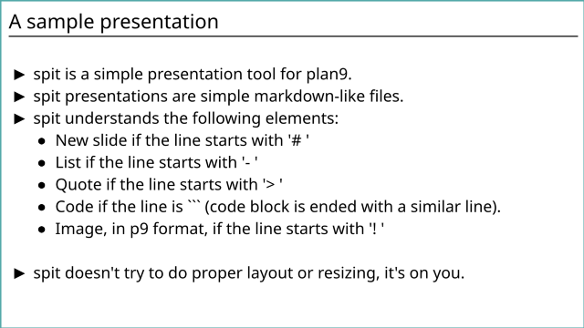
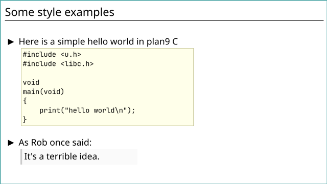

spit
====
A simple presentation tool for 9front.  
spit relies on sigrid's [libpt](https://git.sr.ht/~ft/libpt) for text rendering using TTF fonts.  
  
  

To toggle fullscreen mode press `f`. Navigate between slides using left/right arrow (or backspace/space) or home/end. Press `q` or `del` to quit spit. 

Installation:
-------------
```sh
% git/clone <repository_url>
% cd spit
% mk
% mk install
```

Usage:
------
See `sample.spit` for a sample presentation.
```sh
% spit -f textfont.ttf -F fixedfont.ttf sample.spit
```

Basic configuration of colors and text sizes is available in `style.h`.

Author:
-------
phil9

License:
--------
MIT

Bugs:
-----
Sure, please report!
